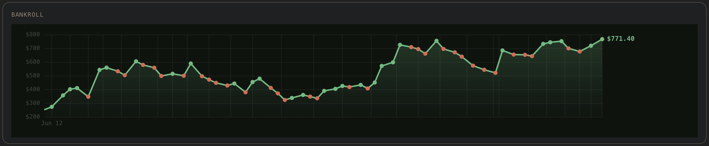
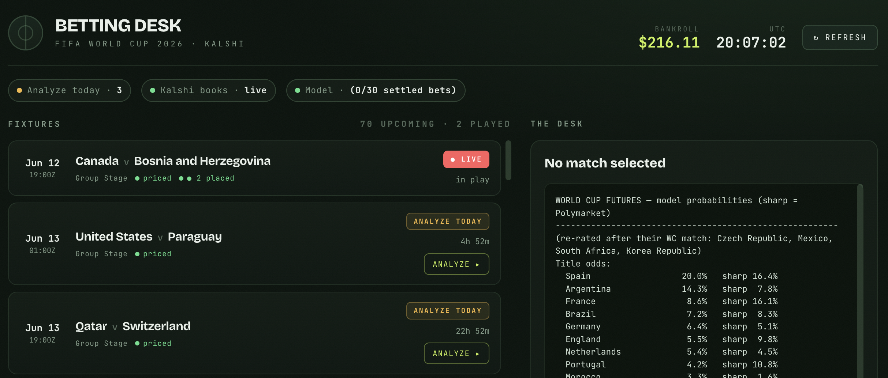

# frontier-xG · World Cup 2026

**Can a frontier model, reasoning from facts alone, price a football match
better than the market?** That's the question we set out to answer — with real
money. For every 2026 World Cup match we assemble a factual dossier, let a
frontier model reason to a calibrated probability **before it is ever shown the
odds**, and only then compare that independent prior against the market. We place
a wager only where the model *and* a deep reference market both disagree with the
price — on Kalshi, and we publish every position, probability, and dossier.

<p align="center"></p>

Over one tournament — 121 settled bets — we grew the bankroll from **$255 to
$771**, a **+202%** return on a **62–59** record. That near-coin-flip record is
the whole point: we don't need to be right more often, we need to be right when
the price is wrong. The edge lives in the *price*, not the hit rate — and
disciplined sizing turns a razor-thin accuracy edge into real compounding.

| Metric | Value | Definition |
|--------|-------|------------|
| Total return | **+202%** | $255 → $771 on the starting bankroll |
| Return on turnover | +20.7% | net P/L ÷ total staked |
| Record | 62–59 | won / lost — barely above a coin flip, by design |
| Brier score | **0.234** vs market **0.251** | our probability vs the Kalshi entry price, scored against realized outcomes — lower is better |

## How we do it

We deliberately separate **data gathering** (deterministic code), **judgment** (a
model that never sees a price), and **pricing/staking** (the only place we let the
market in). Stage by stage:

```
                                                                     Kalshi price ─┐  ┌─ Polymarket (sharp anchor)
                                                                                   ▼  ▼
SportMonks  ──►  Dossier  ──►  Reasoning (frontier LLM)  ──►  xG → market grid  ──► Edge engine ──►  Portfolio  ──►  you confirm  ──►  Kalshi
 squads,          per-match     P(H/D/A) + expected      Dixon-Coles Poisson    two-sided; both   exposure caps      RSA-signed
 form, XI,        fact brief    goals, blind to odds     prices ~24 markets     must disagree     + kill-switch       order
 context                        (src/reasoning.py)       (src/goals.py)         (src/edge.py)     (src/portfolio.py)
```

We only bet when our model *and* Polymarket both disagree with the Kalshi price in
the same direction — the model supplies the number, Polymarket keeps us honest.

1. **Dossier** (`dossier.py`) — we assemble squad, coach and tenure, recent form
   with shot/possession quality, the confirmed starting XI (once published), and
   tournament context, all deterministically. No probabilities here.

2. **Reasoning** (`reasoning.py`) — we hand the dossier to a frontier model
   (configurable via `REASONING_MODEL`; we swapped models across the tournament),
   which reasons at high effort to `P(home/draw/away)` and per-team **expected
   goals** with a written rationale. We forbid it from recalling or anchoring to
   any market price, so the estimate is independent by construction. We
   renormalize the three outcome probabilities to sum to 1. One empirical
   correction we apply: in group games where the model makes a team a clear
   favourite (>55%), we scale its xG ×1.35 to offset a favourite-underestimation
   bias we measured.

3. **xG → market grid** (`goals.py`) — we turn those two expected-goal numbers
   into a Dixon-Coles-adjusted Poisson scoreline matrix (ρ = −0.10, up to 10 goals
   per side), and from it price ~24 Kalshi markets at once: 1X2, totals (0.5–3.5),
   spreads, both-teams-to-score, clean sheets, and team totals. One reasoning pass
   prices the whole match board.

4. **Edge engine** (`edge.py`) — the only place we read a price. We evaluate every
   market **two-sided** (YES and NO) against the Kalshi ask. When a deep market
   (Polymarket) prices the same outcome we use it as a **sharp anchor**: it has to
   agree with our direction (≥1 pt), and we size on the *conservative*
   min(model, sharp) probability. We require an edge of **≥6%** when anchored,
   **≥9%** unanchored, and it must still clear Kalshi's trading fee
   (`ceil(0.07·C·p·(1−p))` cents). We stake **quarter-Kelly**, capped at 12% of
   bankroll per bet.

5. **Portfolio** (`portfolio.py`) — we take the qualifying bets highest-edge-first
   and trim to respect correlation caps: ≤15% of bankroll on any one team/match
   group, ≤50% deployed in total.

6. **Execution & ledger** (`execute.py`, `ledger.py`) — we confirm every order by
   hand, then post it RSA-signed and fill-or-kill to Kalshi. We log the model
   probability, entry price, closing outcome, and P/L, from which we compute the
   Brier score above. A **kill-switch** stops us placing bets once ≥30 have
   settled if our realized edge turns negative or our Brier exceeds the market's
   — i.e. if the hypothesis stops holding.

## Betting desk

We run a local Flask UI to analyze upcoming matches, review the dossier +
reasoning, and place the bets we approve — with a live ledger, calibration
tracking, and the kill-switch.

<p align="center"></p>

## Run

```bash
pip install -r requirements.txt
cp .env.example .env            # add your keys

python -m src.orchestrator markets                 # tradeable WC match markets
python -m src.orchestrator match "Japan" "Sweden"  # dossier + bet sheet
python -m src.web                                  # betting desk at :8000
```

## Layout

| File | Role |
|------|------|
| `src/sportmonks.py` | Cached SportMonks client (rate-limit safe) |
| `src/dossier.py` | Assembles the per-match fact brief |
| `src/reasoning.py` | LLM reasons through the dossier → probabilities |
| `src/edge.py` | Edge vs market + quarter-Kelly bet sheet |
| `src/kalshi.py` | Kalshi read client + RSA-signed trade client |
| `src/ledger.py` | Bet record, P/L, Brier, realized edge, kill-switch |
| `src/orchestrator.py` | Ties it together |
| `src/web.py` | Betting-desk backend |
| `src/publish.py` | Writes structured JSON for the public site |

## Config (`.env`, never committed)

- `MONKS_API_KEY` — SportMonks data.
- `ANTHROPIC_API_KEY` — the reasoning layer.
- `KALSHI_KEY_ID`, `KALSHI_PRIVATE_KEY_PATH` — only to place real orders.
- `PUBLISH_DIR` — where `publish.py` writes site JSON (default `./public/wc2026`).
- `DEPLOY_CMD` — optional shell command the desk's deploy button runs.

## Staking

We size quarter-Kelly and demand a ≥6% edge after fees (≥9% when we have no sharp
line to anchor on), then cap ourselves at ≤12% per bet, ≤15% per correlated group,
and ≤50% deployed in total. The kill-switch pulls us out if our realized edge or
calibration turns negative over the settled sample. Every threshold lives in
`src/config.py`.

## Data & licensing

This is a personal research project, published for transparency — not a product,
a tipping service, or financial advice.

- **What we publish vs. what we don't.** We *do* publish our derived analysis —
  the reasoned ratings, per-match dossiers, lessons, and the full bet ledger
  (`data/`). What we don't ship is the **raw SportMonks feed**: the API cache
  (`data/cache.db`) and raw results dumps stay out. Under SportMonks' terms this
  is the important line — building on their data and even distributing the result
  is permitted; reselling the raw feed is not. Any team logos or photos remain
  their owners'.
- **Bring your own keys.** Running your own copy needs your own **SportMonks**
  license (priced per domain), **Anthropic** API key, and — to place real orders —
  **Kalshi** trading credentials. See `.env.example`.
- **No warranty. Use at your own risk.** This code is provided "as is", with no
  guarantee of correctness, uptime, or profit — past results say nothing about
  the future. Sports betting carries a real risk of losing money. **We take no
  responsibility for any losses, damages, or consequences arising from use of
  this repository.** Bet only what you can afford to lose, and only where it is
  legal for you to do so.
